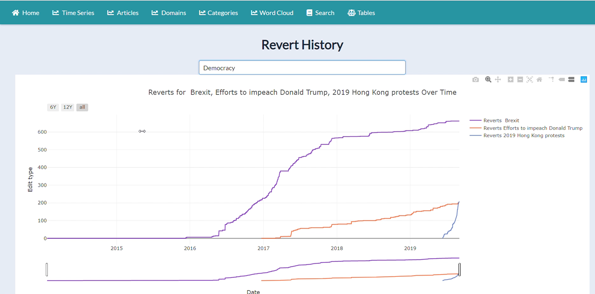
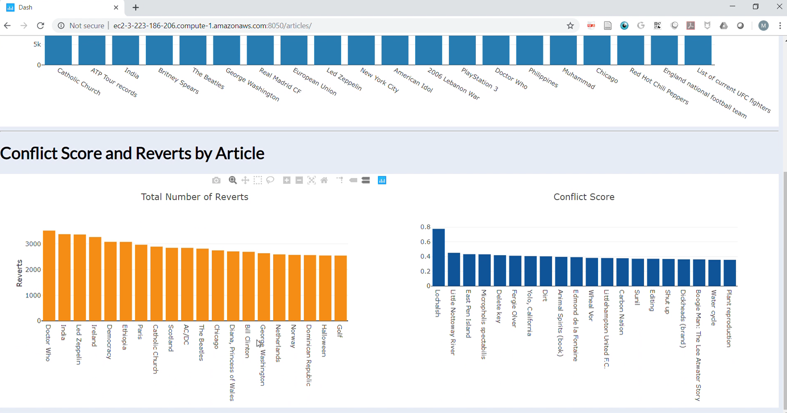
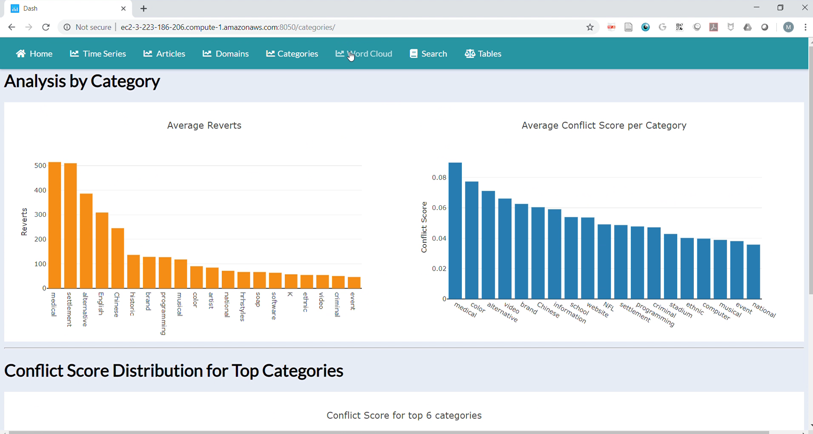
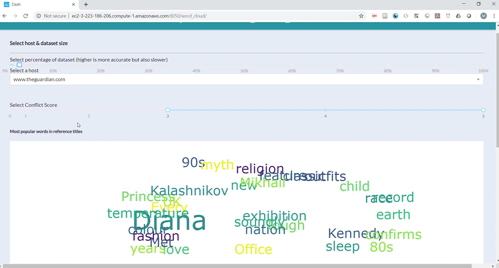
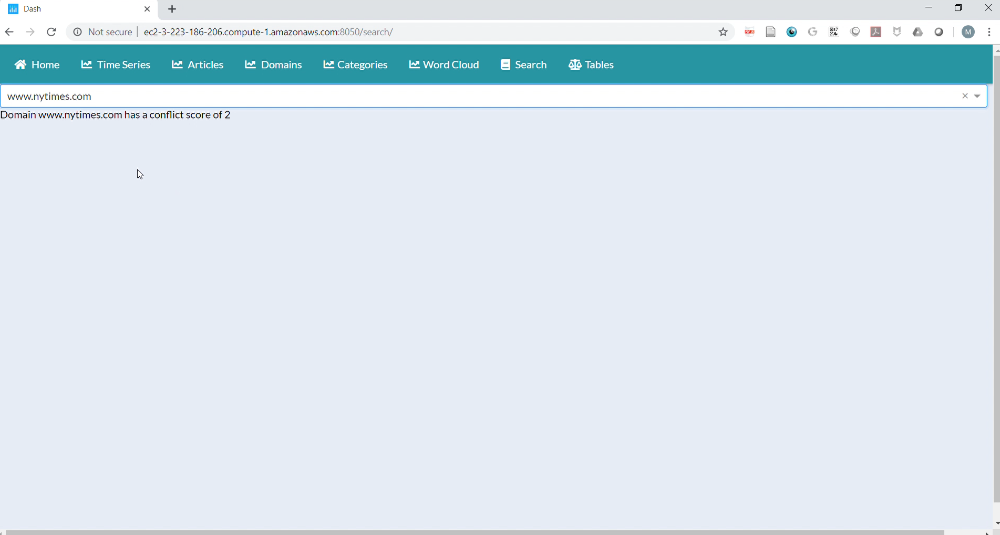

# Source of Conflict


## Insight Data Engineering 2019C
## Manrique Vargas (MV), mv1742@nyu.edu

1. [Introduction](README.md#Introduction)
1. [Motivation](README.md#Motivation)
1. [Requirements](README.md#Requirements)
1. [Pipeline](README.md#Pipeline)
1. [Data Source](README.md#6.-Data-Source)
1. [Metrics](README.md#7.-Metrics)
1. [Methodology](README.md#8.-Methodology)
1. [Dashboard](README.md#9.-Dashboard)
1. [Getting Started](README.md#10.-Getting-Started)
1. [Repo-directory-structure](README.md#Repo-directory-structure)

Go to...

| -> *[presentation slides](https://docs.google.com/presentation/d/1uzJ4H3GOEt4qJk-HOeshhaqHc4EtusS9e92oKj92rIo/edit?usp=sharing)*      |                ->  *[Demo @ dataangel.me](http://dataangel.me/80)*          |
| ------------- |:-------------:|


# 1. Introduction
Source of Conflict is a tool to analyze how references and other features in Wikipedia articles affect the edit history. I calculate different metrics for bias and identify which metrics lead to more edits. Conflict is defined by number of reverted articles. Other features include categories, diversity of references, type of reference, domain, number of edits done by bots.

# 2. Motivation
- Wikipedia needs a metric to quantify the bias of its articles.
- Understand behaviours in crowdsourcing platforms like Wikipedia
- Identify conflictive sources of information
- Evaluate quality of article references

# 3. Requirements
3.1 Data Ingestion
- Python3
- [AWS CLI](https://aws.amazon.com/cli/)
- [boto3](https://boto3.amazonaws.com/v1/documentation/api/latest/guide/quickstart.html#installation)

3.2 Data Processing
- Setup Spark Cluster
    - AWS (or alternative)  
        - Prerequisites
        - AWS account
        - VPC with DNS Resolution enabled
        - Subnet in VPC
        - Security group accepting all inbound and outbound traffic (recommend locking down ports depending on technologies)
        - AWS Access Key ID and AWS Secret Access Key ID
- Spark packages
    - [Spark-XML](https://github.com/databricks/spark-xml)
    - [JDBC](https://jdbc.postgresql.org/download/postgresql-42.2.8.jar)

3.3 Database
- [Postgresql](https://www.postgresql.org/download/)
- [TimescaleDB](https://docs.timescale.com/latest/getting-started/installation)

3.4 Flask app
- [Requirements](.\src\flask\plotlydash-flask\requirements.txt)

# 4. Pipeline


# 5. Architecture
### Spark

6 EC2 m4.large instances (1 master 5 slaves spark cluster)

[Installation](https://blog.insightdatascience.com/simply-install-spark-cluster-mode-341843a52b88)

### Airflow

1 EC2 m4.xlarge instance

[Installation](https://blog.insightdatascience.com/scheduling-spark-jobs-with-airflow-4c66f3144660)

### PostgreSQL

1 EC2 m4.large instance

[Installation](https://blog.insightdatascience.com/simply-install-postgresql-58c1e4ebf252)

### Dash
1 EC2 m4.large instance

[Installation](https://dash.plot.ly/installation)

# 6. Data Source

~500 GB Wikipedia
Use English Wikipedia 'meta-stub' and 'meta-current' datadumps from [datadumps.wikipedia.org/enwiki]

Read more about the Wikipedia dump documentation [here](https://en.wikipedia.org/wiki/Wikipedia:Database_download).
See all available datasets [here](https://dumps.wikimedia.org/backup-index.html).


# 7. Metrics

    1. Article edit history
        1.1 Reverts
        1.2 Number of edits
        1.3 Username
        1.4 Timestamp
    2. Domain information
        2.1 Domain
        2.2 Url
        2.3 Title        
    3. Categories
        3.1 Infobox
        3.2 Sub-categories
    4. Other Data
        4.1 Article length
        4.2 Links from article

# 8. Methodology
## 8.1 Data Collection:
[generate_text_file.py](./src/ingestion/generate_text_file.py): Uses the BeautifulSoup package to parse the urls on the stackexchange data dump to retrieve the urls of the .7z files of all the wikipedia dump.

## 8.2 Parse Wikipedia Articles
[articles.py](./src/dataprocessing/process_articles/articles.py)


## 8.3 Parse Wikipedia Edit History
[edit_history.py](./src/dataprocessing/process_articles/edit_history.py)

## 8.4 Run Data Analytics
[analytics](./src/analytics/wiki_analytics.sql)

# 9. Dashboard

__Figure 1.__ Dashboard showing timeseries of the edit history

__Figure 2.__ Dashboard analysis by article

__Figure 3.__ Dashboard analyiss by domain

__Figure 4.__ Dashboard analysis by category

__Figure 5.__ Search results


# 10. Getting Started

Post installation of all the components of the pipeline, it can be used in two ways:
## 10.1 Initialize the Dag in Airflow and launch it on airflow scheduler:

` cp ~/wiki_bias/src/airflow/de_dag.py ~/airflow/de_dag.py`
 
` python de_dag.py`
  
## 10.2 Run the following scripts:

### 10.2.1 Data Ingestion

` cp ~/wiki_bias/src/ingestion/`

`./download.sh`

### 10.2.2 Spark Processing

` cp ~/wiki_bias/src/dataprocessing/`

`./run_articles.sh`

`./edit_history.sh`

### 10.2.3 PageRank Calculation
` cp ~/wiki_bias/src/pagerank/`

`./page_rank.sh`

### 10.2.4 SQL joins and analytics

`cd $HOME/wiki_bias/src/analytics`

`./run_analytics.sh`

### 10.2.5 Run Flask App

`cd $HOME/wiki_bias/src/flask`

`python wsgi.py`

# 11. Repo directory structure

The directory structure looks like this:
```

├── README.md
├── figs
│   ├── Pipeline.png
│   ├── README.md
│   ├── db1.png
│   ├── db2.png
│   ├── db3.png
│   ├── db4.png
│   └── db5.png
└── src
    ├── airflow
    │   └── de_dag.py
    ├── analytics
    │   ├── run_analytics.sh
    │   └── wiki_analytics.sql
    ├── dataprocessing
    │   ├── README.md
    │   ├── merge
    │   │   └── merge.py
    │   ├── process_articles
    │   │   ├── README.md
    │   │   ├── articles.py
    │   │   └── run_articles.sh
    │   └── process_edit_history
    │       ├── README.md
    │       ├── edit_history.py
    │       └── run_edit_history.sh
    ├── flask
    │   ├── README.md
    │   ├── __init__.py
    │   ├── app1.py
    │   ├── application
    │   ├── assets
    │   ├── config.py
    │   ├── flask_app.py
    │   ├── ldacomplaints.py
    │   ├── requirements.txt
    │   ├── setup.py
    │   ├── start.sh
    │   ├── wiki_bias_py
    │   └── wsgi.py
    └── ingestion
        ├── README.md
        ├── download.sh
        ├── generate_text_file.py
        └── text_files_download
            ├── enwiki_articles_multistream.txt
            └── enwiki_meta_history.txt

```
